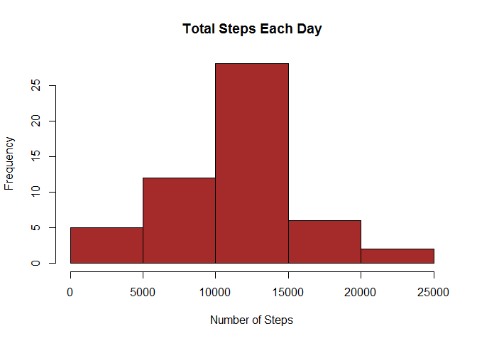
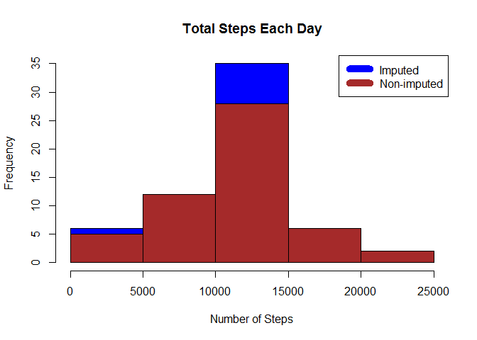

# Reproducible Research
Pradeep Bagavan  
July 22, 2016  


```r
# 1. Code for reading in the dataset and/or processing the data
data <- read.csv("C:/Users/pbagavan/Desktop/repdata%2Fdata%2Factivity/activity.csv")

# 2. Histogram of the total number of steps taken each day
steps.per.day <- aggregate(steps ~ date, data, FUN = "sum")
hist(steps.per.day$steps, main = paste("Total Steps Each Day"), col="brown", xlab="Number of Steps")
```



```r
# 3. Mean and median number of steps taken each day
mean.before <- mean(steps.per.day$steps)
mean.before
```

```
## [1] 10766.19
```

```r
median.before <- median(steps.per.day$steps)
median.before
```

```
## [1] 10765
```

```r
# 4. Time series plot of the average number of steps taken
steps.per.interval <- aggregate(steps ~ interval, data, FUN = "mean")
plot(steps.per.interval$interval,steps.per.interval$steps, type="l", col="orange", xlab="Interval", ylab="Number of Steps",main="Average Number of Steps per Day by Interval")
```


```r
# 5. The 5-minute interval that, on average, contains the maximum number of steps
max.steps.interval <- steps.per.interval[which.max(steps.per.interval$steps),1]

#6 Code to describe and show a strategy for imputing missing data
imputed <- transform(data, steps = ifelse(is.na(data$steps), steps.per.interval$steps[match(data$interval, steps.per.interval$interval)], data$steps))
imputed[as.character(imputed$date) == "2012-10-01", 1] <- 0

#7 Histogram of the total number of steps taken each day after missing values are imputed
steps.per.day.after.impute <- aggregate(steps ~ date, imputed, FUN = "sum")
hist(steps.per.day.after.impute$steps, main = paste("Total Steps Each Day"), col="blue", xlab="Number of Steps")
hist(steps.per.day$steps, main = paste("Total Steps Each Day"), col="brown", xlab="Number of Steps", add=T)
legend("topright", c("Imputed", "Non-imputed"), col=c("blue", "brown"), lwd=10)
mean.after <- mean(steps.per.day.after.impute$steps)
mean.after
```

```
## [1] 10589.69
```

```r
median.after <- median(steps.per.day.after.impute$steps)
median.after
```

```
## [1] 10766.19
```

```r
mean.difference<- mean.after - mean.before
mean.difference
```

```
## [1] -176.4949
```

```r
median.difference <- median.after - median.before
median.difference
```

```
## [1] 1.188679
```

```r
overall.difference <- sum(steps.per.day.after.impute$steps) - sum(steps.per.day$steps)
overall.difference
```

```
## [1] 75363.32
```

```r
#8 Panel plot comparing the average number of steps taken per 5-minute interval across weekdays and weekends
weekdays <- c("Monday", "Tuesday", "Wednesday", "Thursday", 
              "Friday")
imputed$weektype = as.factor(ifelse(is.element(weekdays(as.Date(imputed$date)),weekdays), "Weekday", "Weekend"))
steps.per.interval.after.impute <- aggregate(steps ~ interval + weektype, imputed, FUN="mean")
library(lattice)
```


```r
xyplot(steps.per.interval.after.impute$steps ~ steps.per.interval.after.impute$interval|steps.per.interval.after.impute$weektype, main="Average Steps per Day by Interval",xlab="Interval", ylab="Steps",layout=c(1,2), type="l")
```


